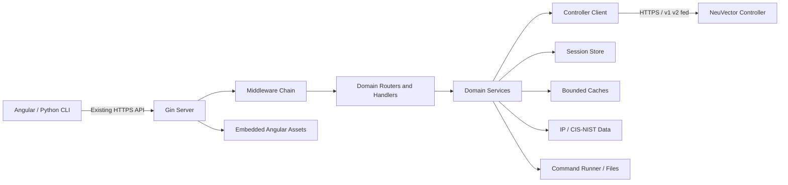
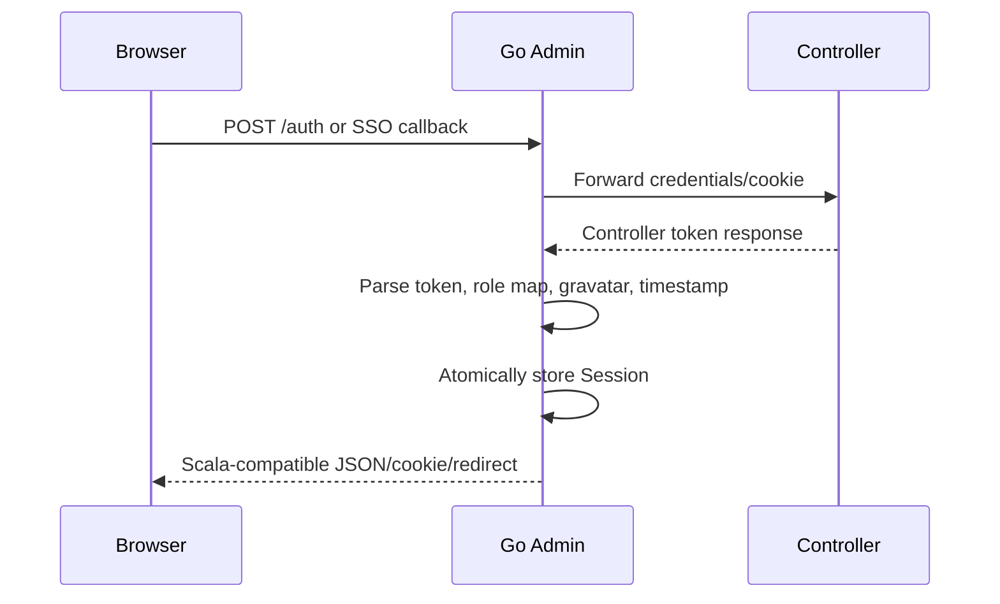

# Admin 后端 Go/Gin 重构设计文档

| 属性 | 内容 |
| --- | --- |
| 文档状态 | Draft，需求规格说明书冻结后进入评审 |
| 上游基线 | `01-requirements-specification.md` 0.1 |
| 目标实现目录 | `admin-go/` |
| Go module | `github.com/neuvector/manager/admin-go` |
| 最后更新 | 2026-08-01 |

## 1. 设计目标与原则

本设计在不改变 Manager 外部协议的前提下，以 Go/Gin 替换 Scala/Pekko Admin。
核心原则如下：

1. **兼容优先**：生产可观察行为高于内部代码形式；迁移不主动“美化”API。
2. **透传优先**：无业务转换的 Controller 响应直接流式透传，减少 JSON 差异和内存复制。
3. **有界并发**：HTTP 连接、goroutine、缓存、文件和外部命令均有容量与超时。
4. **请求隔离**：用户、Token、集群、目标 URL 和事务信息只通过显式 Context 传递。
5. **安全默认**：敏感数据不进日志；TLS/FIPS、Body 上限和安全 Header 是发布门禁。
6. **可替换边界**：Controller、Session、Cache、Clock、Command Runner 均以接口隔离测试。

## 2. 总体架构



Gin 只负责路由、Binding 和中间件。业务规则不得放入 Gin Handler；Handler 将 HTTP
输入转换为领域命令，Service 完成业务编排，Controller Client 负责下游协议。

## 3. 代码与模块组织

```text
admin-go/
├── cmd/manager/main.go              # 组装依赖、启动与优雅退出
├── internal/
│   ├── config/                      # 环境变量、默认值、校验
│   ├── server/                      # Gin、HTTP(S)、路由注册、内部探针
│   ├── middleware/                  # recovery、request ID、日志、安全头、限制
│   ├── controller/                  # Controller URL、请求、响应、TLS、错误
│   ├── session/                     # Token/SUSE/联邦状态
│   ├── cache/                       # 分页、JSON、图、黑名单、支持日志缓存
│   ├── static/                      # embed.FS、版本重定向、gzip 资源
│   ├── localdata/                   # IP2Location、CIS/NIST 加载和查询
│   ├── command/                     # 支持日志和 benchmark 受控执行
│   ├── contract/                    # 通用响应、错误及兼容辅助函数
│   └── domain/                      # auth/dashboard/... 领域 Handler 与 Service
├── assets/                          # 构建时复制的 CSV 与 Angular 产物
├── testdata/contract/               # 脱敏 golden fixtures
├── go.mod
└── go.sum
```

领域目录固定为 `auth`、`account`、`federation`、`dashboard`、`device`、`group`、
`notification`、`policy`、`risk`、`sigstore`、`workload`。不得创建跨领域的万能
`utils`；共享能力进入职责明确的基础包。

## 4. 进程启动与生命周期

### 4.1 启动顺序

1. 解析并校验配置；记录生效值，敏感值只记录是否设置；
2. 初始化结构化 Logger 和构建信息；
3. 加载 IP 与 CIS/NIST 数据，失败则终止启动；
4. 初始化 TLS/FIPS、Controller Transport、Session 与 Cache；
5. 构造 Domain Service、Handler、Router 和静态资源服务；
6. 启动主 HTTP(S) Listener，再启动可选内部探针 Listener；
7. readiness 在所有必要资源初始化完成后变为 ready。

收到 SIGTERM/SIGINT 后，readiness 立即失败，先取消 support job 根 Context、终止其进程组并
清理临时输出，再调用 `http.Server.Shutdown`；默认 30 秒内等待其余在途请求后退出。

### 4.2 配置模型

`config.Config` 使用嵌套强类型结构，不允许业务代码直接调用 `os.Getenv`：

```go
type Config struct {
    Server     ServerConfig
    Controller ControllerConfig
    TLS        TLSConfig
    Cache      CacheConfig
    Static     StaticConfig
    Runtime    RuntimeConfig
}
```

现有环境变量名称和默认值保持不变。新增内部选项必须有安全默认值：

| 配置 | 默认值 | 用途 |
| --- | --- | --- |
| `MANAGER_SHUTDOWN_TIMEOUT` | `30s` | 优雅退出期限 |
| `MANAGER_INTERNAL_ADDR` | 空，禁用 | 独立内部 health/metrics Listener |
| `CTRL_TLS_VERIFY` | 与当前兼容模式一致 | 显式控制 Controller 证书校验 |
| `MANAGER_CACHE_MAX_BYTES` | 按各缓存预算配置 | 进程内缓存总预算保护 |
| `MANAGER_CACHE_MAX_ENTRIES` | `1000` | 分页缓存条目上限 |
| `MANAGER_CACHE_TTL` | `5m` | 分页缓存短 TTL |
| `MANAGER_SUPPORT_COMMAND` | `/usr/local/bin/support` | 固定 support executable |
| `MANAGER_SUPPORT_TEMP_DIR` | `/tmp/neuvector-support` | owner-only 临时目录 |
| `MANAGER_SUPPORT_TIMEOUT` | `10m` | 单个 support job 硬超时 |
| `MANAGER_SUPPORT_MAX_FILE_BYTES` | `64m` | 压缩及解压校验上限 |
| `MANAGER_SUPPORT_MAX_CONCURRENT` | `2` | 全局并发 job 上限 |

新增配置不改变现有配置优先级。无效 duration、端口、Header 长度、路径或缓存容量
在启动时返回聚合错误。

## 5. HTTP Server 与 Middleware

### 5.1 Gin 初始化

使用 `gin.New()`，不使用带默认 Logger 的 `gin.Default()`。Middleware 顺序固定为：

1. request ID 获取或生成；
2. panic recovery 和脱敏错误记录；
3. remote IP/Host 兼容处理；
4. 访问日志与延迟统计；
5. Header 长度及 Body 大小限制；
6. 条件安全响应头；
7. `PATH_PREFIX` 路由组；
8. 领域路由或静态资源 Handler。

Recovery 对客户端返回兼容的 500 Body，不返回 panic、堆栈或内部路径。日志使用 Go
`log/slog` 兼容接口；如选择第三方输出适配器，不允许领域代码依赖它。

### 5.2 路由注册

每个领域实现以下注册函数：

```go
type Dependencies struct {
    Service Service
}

func RegisterRoutes(group *gin.RouterGroup, deps Dependencies)
```

路由路径和 HTTP 方法由契约测试生成固定快照。注册后测试遍历 `engine.Routes()`，与
Scala 路由目录比较，发现新增、遗漏或方法变化即失败。API 路由优先于静态资源；未知
API 返回 404，不回退到 `index.html`。

### 5.3 请求和响应类型

接口分为三种处理模式：

| 模式 | 适用接口 | 实现 |
| --- | --- | --- |
| Transparent Proxy | 无变换 CRUD、下载 | 保留状态、Header 和 Body，流式复制 |
| Typed Transform | 聚合、排序、字段派生 | 明确 Go struct 和兼容 Codec |
| Multipart/Stream | 导入、支持日志、PCAP | `io.Reader`/`io.CopyBuffer`，限制大小 |

禁止对 Transparent Proxy 使用 `map[string]any` 解码再编码。Typed Transform 必须为
`null`、missing、空数组、空对象和大整数编写 golden test。只有协议明确允许时才使用
`omitempty`。

## 6. 请求 Context 与身份传播

Handler 将以下数据写入自定义不可变 `RequestScope`，通过标准 `context.Context` 传递：

```go
type RequestScope struct {
    RequestID     string
    Token         string
    SUSEToken     string
    ClusterID     string
    TransactionID string
    AsStandalone  string
    SourcePage    string
    ClientIP      net.IP
    Host          string
}
```

禁止使用 package 全局变量保存请求信息。下游 URL 每次由 `TargetResolver` 根据配置、
API 版本和 `ClusterID` 计算：

```text
local v1: https://<controller>:<port>/v1
local v2: https://<controller>:<port>/v2
fed v1:   https://<controller>:<port>/v1/fed/cluster/<id>/v1
fed v2:   https://<controller>:<port>/v1/fed/cluster/<id>/v2
```

Cluster ID 作为 URL path segment 转义。事务导入导出所需 base URL 只存在于当前调用
栈，不复制 Scala `tokenBaseUrlMap` 的共享临时状态。

## 7. Controller Client

### 7.1 接口

```go
type Client interface {
    Do(ctx context.Context, req Request) (*http.Response, error)
}

type Request struct {
    Method      string
    Version     APIVersion
    Path        string
    Query       url.Values
    Header      http.Header
    Body        io.Reader
    ContentLength int64
}
```

`Request` 不接受完整任意 URL，防止 SSRF；Host 和 Port 只来自验证后的配置，联邦集群
仅作为转义后的路径段。

### 7.2 Transport 与超时

进程只创建少量可复用 `http.Transport`，设置连接、TLS handshake、response header、
idle connection、每 Host 连接数和空闲连接上限。总请求期限由 API 分类设置，并受
客户端取消控制；不能用无 Context 的 `http.Client`。

Controller 非 2xx 响应包装为 `controller.Error`，包含状态、Reason、可重放 Body 和
脱敏元数据。兼容层按现有规则处理：

- Controller 401/特定认证文本映射 Session expired 或 Authentication failed；
- 错误码 14 返回 400；47、48、50 返回现有认证消息；
- timeout 映射 408，Controller unavailable 映射既有 503/500 行为；
- 未特判的响应保留 Controller 状态和实体。

### 7.3 TLS

Server TLS 与 Controller Client TLS 分开配置。Server 支持证书链、PKCS#1/PKCS#8
私钥和缺省自签名证书。自签名证书保持 RSA 2048、SHA-256、1 年有效期、`neuvector`
SAN 及 server/client auth EKU。临时证书和私钥只驻留进程内存，不写入容器文件系统；
日志只记录证书来源，不记录证书或密钥内容。生产部署必须挂载受信任证书对。

Controller 当前等价于跳过证书验证。Go 兼容实现必须通过命名明确的配置和安全例外
启用，禁止散落 `InsecureSkipVerify: true`。安全团队批准后可提供 CA 验证模式，但默认
切换属于独立产品变更。

FIPS 构建使用安全团队批准的 Go 工具链、密码实现和基础镜像；普通 Go build 结果不能
标记为 FIPS。CI 必须验证二进制来源、运行时 FIPS 状态和所用算法。

## 8. Session 与认证设计

### 8.1 Session 模型

```go
type Session struct {
    User             UserToken
    SUSEToken        string
    SelectedCluster  string
    LoginTimestamp   time.Time
    IsSUSEAuth       bool
}

type Store interface {
    Get(token string) (Session, bool)
    Put(token string, session Session)
    Update(token string, fn func(*Session) error) error
    Delete(token string)
}
```

内存实现使用分片 Map 或 `sync.RWMutex`，返回副本而非内部指针。`Update` 保证集群切换
等复合操作原子化；登出一次删除全部关联状态。Session 上限和过期清理由 Controller
Token timeout 与配置共同决定。

### 8.2 登录时序



OIDC state 和 SAML/OIDC 登录结果通过有 TTL、容量上限和原子消费语义的专用 Store 保存，避免
魔法固定 Key 覆盖并发登录。浏览器只持有随机 flow/handoff capability；OIDC state 错配、过期、
重放或跨实例请求均 fail closed。首版 Store 位于进程内，生产负载均衡器必须在完整 SSO 链路
启用粘性会话；共享状态替换必须保持原子 get-and-delete。安全细节与测试矩阵见
[`06-sso-security-design.md`](06-sso-security-design.md)。

## 9. Cache 设计

定义泛型 Cache 接口并为不同业务建立独立实例：

```go
type Cache[K comparable, V any] interface {
    Get(K) (V, bool)
    Set(K, V, Options)
    Delete(K)
    DeletePrefix(string)
}
```

首版使用进程内有界 LRU/LFU 实现，不新增 Redis。Cache key 必须包含 Token/用户、集群、
领域、过滤条件和分页信息，防止跨用户泄漏。默认预算参考现有 Ehcache 的逻辑容量，
但以字节、条目、TTL 三重上限保护：

| Cache | 数据 | 持久性 |
| --- | --- | --- |
| Pagination | workload/group/policy/audit 分页 | 进程内，短 TTL |
| JSON | multi-cluster summary | 进程内，短 TTL |
| Graph | 用户节点布局 | 首版进程内；重启丢失需与现状验证 |
| Blacklist | 用户图黑名单 | 首版进程内；行为由契约固定 |
| SupportJob | Token/cluster 到运行 job | 有界并发、10 分钟结果 TTL、下载/退出清理 |

磁盘持久行为是否为实际产品依赖必须在需求待评审项中确认；未确认前不得声称与
Ehcache 持久性等价。

## 10. 领域 Service 设计

### 10.1 迁移策略

- 简单 CRUD 调用统一 Proxy Service，保持下游响应；
- 领域特有转换保留在对应 Service，不进入 Controller Client；
- 多个 Controller 请求使用 `errgroup.WithContext` 并设置并发上限；任一必要请求失败时
  取消其余请求；
- Scala 中的 `Await.result` 和 `Thread.sleep` 替换为 Context、Timer 或显式轮询策略；
- 排序必须定义稳定性和 tie-breaker，避免 Go Map 迭代顺序改变响应。

### 10.2 复杂领域关注点

| 领域 | 设计要求 |
| --- | --- |
| Dashboard | 并发获取 summary/score/alerts；缓存 key 包含 owner/cluster/domain；固定聚合顺序 |
| Policy | 分页及规则排序保持稳定；事务 Header 请求范围化；导入导出采用流式 I/O |
| Group | group/service/DLP/WAF schema 分离；缓存失效覆盖 CRUD 和导入 |
| Device | support log 状态机、外部命令并发限制、临时文件权限及清理 |
| Notification | 网络图纯函数化；layout/blacklist 用户隔离；IP 查询只读 |
| Risk | CVE 资产视图和 compliance 聚合使用强类型模型；大结果避免多份拷贝 |
| Authentication | 所有回调参数、Host、Client IP、Cookie 和重定向必须进入契约样本 |

## 11. 静态资源设计

Angular production build 输出复制到 `admin-go/assets/web/root`，通过 `go:embed` 打入
Go binary。普通模式使用版本字符串 MD5 的前 10 位作为 `index.html?v=`，保持现有地址；
`GODEBUG=fips140=only` 时使用 SHA-256 的前 10 位，避免调用被 Go FIPS-only runtime 禁止的
MD5。`emailHash` 采用相同策略；这些值只能用于 cache busting 和 Gravatar，不能作为安全摘要。

静态 Handler 的决策顺序：

1. 处理根路径和 `index.html` 版本重定向；
2. `favicon.ico` 返回现有 404；
3. 开发模式读取未压缩资源；
4. 生产 `.js` 请求读取预压缩 `.js.gz`，设置兼容 Header；
5. 其他资源从 embed FS 返回；
6. 路径在清理和转义后必须仍位于 embed 根目录，阻止 path traversal。

安全 Header 使用表驱动策略覆盖 SSL、静态资源、JavaScript 和开发模式组合，并由测试
逐个校验。CSP 内容在兼容阶段保持不变。

## 12. 本地数据、文件和命令

- IP CSV 以只读资源交付到 `/usr/share/neuvector/IP2LOCATION-LITE-DB1.CSV` 和
  `/usr/share/neuvector/IP2LOCATION-LITE-DB1.IPV6.CSV`；CIS/NIST 数据位于
  `/usr/share/neuvector/CIS_NIST-MASTER.CSV`；
- CSV 在启动时完整解析到不可变结构，再原子发布；不得边加载边接受请求；
- 上传先施加 `MaxBytesReader` 和 multipart 限制，再写入权限为 `0600` 的临时文件；
- 下载通过 `io.CopyBuffer` 流式传输，传播 Content-Type、Content-Disposition 和状态；
- support executable 固定为经过启动校验的绝对路径；Token/session 通过环境而非 argv 传递；
- support job 使用 `exec.CommandContext`、进程组和 semaphore；超时、同 Token 替换及退出时
  取消并等待子进程，启动失败、非零退出、不安全/损坏/超限结果均删除；
- `/tmp/neuvector-support` 必须为当前 UID 所有且权限不宽于 `0700`。Python 使用独占临时名、
  `0600`、`fsync` 和 `os.replace` 发布结果；下载成功或中断后一次性撤销授权并删除文件；
- Manager/support 在 UID/GID `1000:1000`、只读 rootfs、`/tmp` tmpfs 和 `cap-drop ALL` 下运行，
  不要求额外 Linux capability。

## 13. 可观测性与运维

访问日志字段固定为：`timestamp`、`level`、`request_id`、`method`、`route`、`status`、
`latency_ms`、`response_bytes`、`controller_status`、`cluster_present`。不得把原始 URL
Query 整体写入日志，以免泄露 Token 或镜像凭据。

可选内部 Listener 提供：

- `/livez`：事件循环可响应且未进入关闭阶段；
- `/readyz`：配置、TLS 和本地数据已加载，关闭期间失败；
- `/metrics`：请求数、延迟、Controller 错误、缓存、goroutine 和内存指标。

内部 Listener 默认禁用；启用时由部署网络策略保护。pprof 仅允许测试构建显式启用。

## 14. 构建、镜像与供应链

多阶段构建顺序为 Angular build、Go build、运行镜像组装。Go build 注入 `version`、
`commit`、`buildDate`，开启可复现选项并去除无用符号；FIPS build 使用独立受批准 Stage。

运行镜像继续包含 Python CLI、脚本、许可证和 UI，但删除：

- `/usr/lib64/jvm` 和 `JAVA_HOME`；
- `admin-assembly-1.0.jar`；
- Java security 配置和 Pekko/Scala 运行依赖；
- `entrypoint.sh` 中所有 Java JVM 参数。

入口最终直接 `exec /usr/local/bin/manager`。镜像保留非 root UID 1000、OCI Label、SBOM、
provenance 和 amd64/arm64 buildx 发布。

## 15. 测试架构

| 层级 | 内容 | 工具/方式 |
| --- | --- | --- |
| Unit | URL、角色映射、Codec、Cache、Header、错误映射 | `go test`, table tests |
| Race | Session、Cache、并发聚合、关闭 | `go test -race` |
| Contract | 相同请求分别调用 Scala/Go，比较规范化结果 | Controller mock + golden |
| Integration | Auth/SSO、上传下载、TLS、Controller 故障 | 容器化测试环境 |
| E2E | Angular 主流程和 Python CLI | Browser/CLI 自动化 |
| Performance | RSS、CPU、吞吐、P95/P99、峰值内存 | 固定数据和负载脚本 |
| Security | FIPS、TLS、Header、依赖、镜像、秘密扫描 | CI + 安全验证环境 |

差分比较默认严格比较状态、Header、Cookie 和 JSON。只允许规范化 Date、request ID 等
已批准非确定字段；每个忽略规则必须记录原因，不能使用全局宽松比较。

## 16. 部署、切换与回滚

不采用长期按路由拆分 Scala/Go 的生产架构，因为认证与联邦状态是进程本地的。开发期
可以对固定测试流量执行 shadow，对有副作用请求只记录输入而不双写。

正式发布采用整体蓝绿：

1. 部署 Go 绿色实例但不接收用户流量；
2. 执行 readiness、smoke、契约和 FIPS 检查；
3. 将新会话流量切至 Go，已有会话因进程本地状态可能需要重新登录；
4. 观察错误率、P95、RSS、Controller 错误和登录成功率；
5. 超过阈值立即切回 Scala 镜像；无数据迁移需要反向操作。

是否要求切换时保持现有登录会话，须在需求冻结前确认；若必须保持，则需要一次性
加密 Session 转移机制，会扩大范围和安全评审成本。

## 17. 关键设计决策

| ADR | 决策 | 理由 |
| --- | --- | --- |
| ADR-001 | 使用 Gin，但业务层不依赖 Gin Context | 控制框架耦合并便于测试 |
| ADR-002 | 透明接口 Body 流式透传 | 最大化兼容性并降低内存 |
| ADR-003 | 首版使用有界进程内 Session/Cache | 保持部署模型，不新增基础设施 |
| ADR-004 | 按域开发、整体蓝绿切换 | 避免跨进程认证状态不一致 |
| ADR-005 | 静态资源使用 `go:embed` | 保持单一运行产物和现有交付方式 |
| ADR-006 | 请求级 URL 不存入共享 Session | 消除并发串线风险 |
| ADR-007 | FIPS 在 POC 阶段前置验证 | 避免完成重写后发现发布不可行 |

## 18. 需求映射

| 设计组件 | 覆盖需求 |
| --- | --- |
| Config/Lifecycle | `FR-CFG-*`, `NFR-REL-*` |
| Gin/Middleware/Router | `IF-001`~`IF-008`, `NFR-SEC-004`, `NFR-OBS-*` |
| Controller Client | `FR-CTL-*`, `NFR-PERF-*`, `NFR-REL-001` |
| Session/Auth | `FR-AUTH-*`, `FR-CACHE-003`, `NFR-SEC-*` |
| Cache/Local Data | `FR-DATA-*`, `FR-CACHE-*`, `FR-LOCAL-001` |
| Static | `IF-020`~`IF-024`, `FR-STATIC-*`, `NFR-SEC-006` |
| Command/File | `FR-OPS-*`, `IF-007`, `NFR-REL-002` |
| Build/Release | `NFR-BUILD-*`, `NFR-SEC-001`, `NFR-REL-003` |

## 19. 修订记录

| 版本 | 日期 | 说明 |
| --- | --- | --- |
| 0.1 | 2026-08-01 | 基于需求规格说明书 0.1 建立 Go/Gin 设计初稿 |
